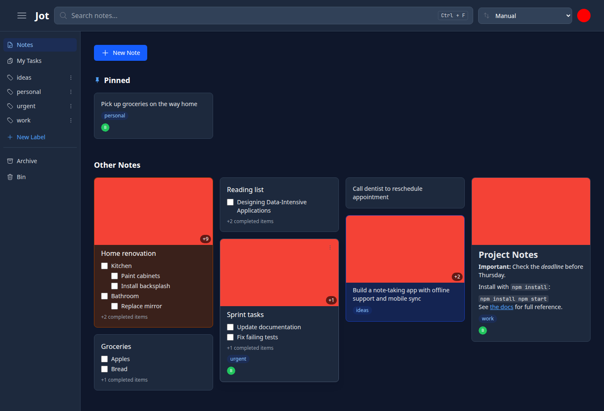
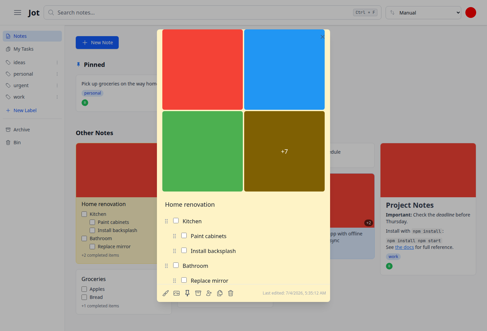
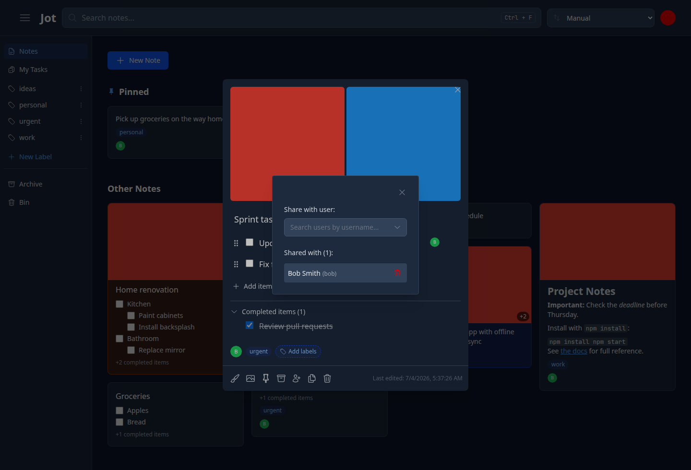
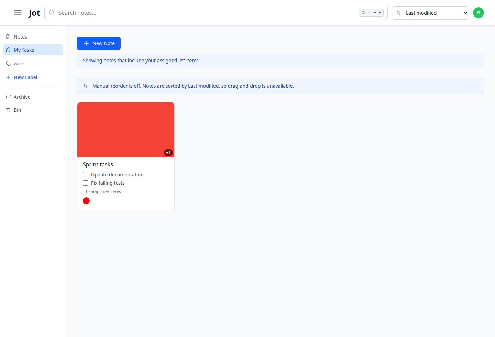
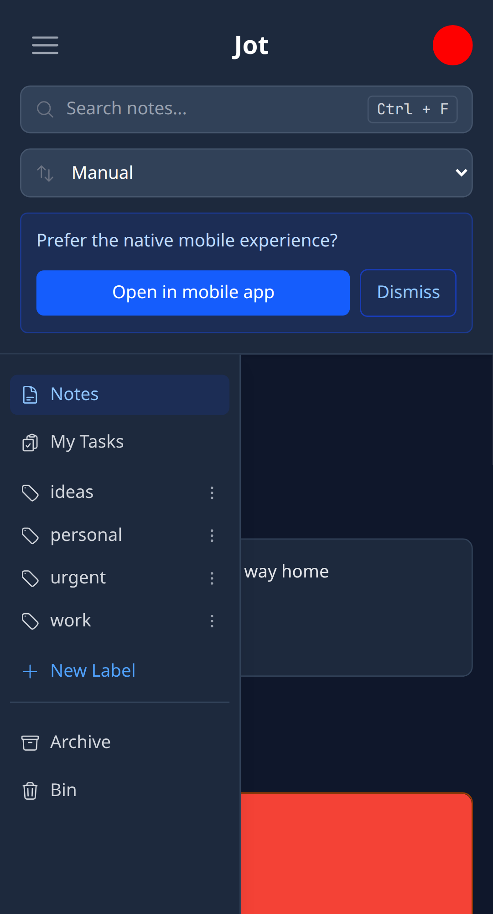

# Jot - Self-hosted note-taking

Jot is a self-hosted note-taking app with a Go API, a React web app, and a
React Native mobile app. A single Go binary can serve both the API and the
compiled web app, while SQLite keeps the default deployment small and portable.

## Features

### Notes and organization

- **Text and list notes**: Write Markdown text notes or checklist-style list
  notes with nested items.
- **Images**: Attach note images with cover thumbnails, galleries, and a
  lightbox viewer.
- **Labels and color**: Group notes with labels, filter from the sidebar, and
  apply note colors.
- **Search and shortcuts**: Search across notes quickly, with keyboard
  shortcuts for common navigation and creation actions.
- **Pin, archive, duplicate, trash**: Keep active notes focused while retaining
  archived notes and automatically purging trashed notes after seven days.
- **Import and export**: Import from Jot JSON, Google Keep, or usememos, and
  export your Jot notes as JSON.

### Collaboration

- **Sharing**: Share notes with other users while preserving owner/share access
  boundaries.
- **Live updates**: Server-sent events keep notes, labels, profile icons, and
  image changes in sync across clients.
- **Collaborator avatars**: Note cards and editors show owner and collaborator
  avatars.
- **Task assignment**: Assign list items to collaborators and use the My Tasks
  view to focus on assigned work.

### Apps and access

- **Responsive web app**: The React app works on desktop and mobile browsers and
  installs as a PWA with offline caching.
- **Mobile app**: The React Native/Expo app supports multiple servers, local
  SQLite persistence, offline write queueing, SSE sync, image uploads, and
  Android/iOS share-to-note.
- **App-icon quick actions**: Long-press the mobile app icon for New note and
  New list shortcuts that open the editor with the keyboard ready, even offline.
- **Sessions and PATs**: Browser sessions use HttpOnly cookies with sliding
  30-day expiry; Personal Access Tokens support API and automation use cases.
- **MCP server**: Authenticated MCP clients can manage notes and labels over the
  streamable HTTP endpoint.
- **Internationalization**: The web and mobile apps include English, German,
  Spanish, French, Italian, Dutch, Polish, and Portuguese.

### Self-hosting and operations

- **Single binary**: Build one Go binary that serves the API and compiled web
  assets.
- **SQLite by default, Postgres optional**: Start with a local SQLite file or
  point `DB_DRIVER=postgres` at a Postgres DSN.
- **Filesystem blob storage**: Uploaded images are stored under `UPLOAD_DIR` as
  content-addressed blobs.
- **Admin tools**: The first registered user becomes admin; admins can manage
  users in the web UI or with `jotctl`.
- **Observability**: Optional Prometheus metrics, OpenTelemetry traces, metrics,
  logs, request logs, and a Grafana dashboard are included.

## Screenshots

### Dashboard with labels, images, and shared notes


### Image gallery


### Sharing and collaborators


### My Tasks


### Mobile layout


## Development Setup

### Prerequisites

- **Go 1.26+**: [Download Go](https://golang.org/dl/)
- **Node.js 24+**: [Download Node.js](https://nodejs.org/)
- **npm**: Package manager for web, shared, and mobile dependencies

### Quick Start

1. **Clone the repository**:
   ```bash
   git clone <repository-url>
   cd jot
   ```

2. **Build and run** (recommended for most development):
   ```bash
   # Build the frontend.
   cd webapp
   npm ci
   npm run build
   cd ..

   # Start the server, which serves both API and frontend.
   cd server
   COOKIE_SECURE=false go run main.go
   ```

### Task Automation

This project includes a [Taskfile](https://taskfile.dev/) for common development tasks:

```bash
# Install Task (if not already installed)
go install github.com/go-task/task/v3/cmd/task@latest

# Available commands
task run-server      # Start the Jot server
task run-webapp      # Start webapp dev server with HMR
task test            # Run all tests
task test-server     # Run server tests
task test-webapp     # Run webapp tests
task test-e2e        # Run Playwright end-to-end tests
task test-mobile     # Run mobile app tests
task coverage        # Run server tests with coverage report
task lint            # Run linters
task lint-server     # Run server linting with golangci-lint
task lint-webapp     # Run webapp linting
task lint-mobile     # Run mobile app linting
task lint-shared     # Run shared package linting
task test-shared     # Run shared package tests
task check-translations # Check locale files for missing/extra keys
task gen-docs        # Regenerate Swagger API docs
task build-jotctl    # Build the jotctl admin CLI binary
task clean           # Remove generated files and node packages
```

3. **Access the application**:
   - Open `http://localhost:8080` in your browser
   - Register your first account with a username and password (becomes admin automatically)
   - Open the Admin page to view the instance overview cards and manage users
   - Start creating notes!

### Development Options

#### Vite dev server
Run the Vite dev server for instant hot module replacement:

```bash
# Terminal 1: start the Go backend.
COOKIE_SECURE=false task run-server

# Terminal 2: start the Vite dev server with HMR.
task run-webapp
```

Access: `http://localhost:5173` — API calls are proxied to the Go server automatically.

## Mobile app

The `mobile/` app is built with React Native and Expo. It connects to any Jot
server URL you configure at sign-in, stores per-server sessions securely, and
uses a local SQLite database for cached notes and queued offline writes.

```bash
cd mobile
npm ci
npm run android   # Android device or emulator
npm run ios       # iOS simulator, macOS only
```

The Android APK workflow lives in `.github/workflows/mobile-apk.yml`. Android
share-to-note is supported through the mobile share sheet: share selected text
to Jot, choose the target server if needed, and save it as a new note.

## Environment Variables

Configure the server with environment variables or a `.env` file.

### Core server

| Variable | Default | Description |
| --- | --- | --- |
| `PORT` | `8080` | HTTP port for the main web/API server. |
| `STATIC_DIR` | `../webapp/build` from `server/` | Directory containing the compiled web app. |
| `CORS_ALLOWED_ORIGIN` | empty | Allowed browser origin for credentialed cross-origin API calls, such as `http://localhost:5173` during Vite development. |

### Database and uploads

| Variable | Default | Description |
| --- | --- | --- |
| `DB_DRIVER` | `sqlite` | Database driver: `sqlite` or `postgres`. |
| `DB_DSN` | `./jot.db` | SQLite file path or Postgres connection string. |
| `UPLOAD_DIR` | `./uploads` | Filesystem root for uploaded image blobs and thumbnails. |
| `UPLOAD_MAX_BYTES` | `26214400` | Maximum upload size per note image, from 1 MiB to 500 MiB. |

### Access control

| Variable | Default | Description |
| --- | --- | --- |
| `COOKIE_SECURE` | `true` | Sets the session cookie `Secure` flag. Use `false` only for local HTTP development. |
| `REGISTRATION_ENABLED` | `true` | Set to `false` to disable public registration; admins can still create users. |
| `PASSWORD_MIN_LENGTH` | `10` | Minimum password length, from 1 to 72 characters. |

### Rate limiting

Every authenticated `/api/v1` route, plus `/register`, `/login`, and `/logout`,
is rate-limited to guard against unintentional internal overload — a
client-side bug or flaky network turning an offline sync queue or SSE
reconnect loop into a tight request loop against the server — rather than
against malicious users (see the threat model in `CLAUDE.md`). A request over
its limit gets `429 Too Many Requests` with a `Retry-After` header. Defaults
are generous enough that normal interactive use (dashboard load, SSE, note
editing, syncing after a short offline period) should never hit them.
(`GET /config` is the one unauthenticated, side-effect-free exception: it's
fetched on every page load, so it is intentionally left unlimited rather than
risk throttling normal multi-user traffic behind a shared IP — see the
reverse-proxy caveat below.)

| Variable | Default | Description |
| --- | --- | --- |
| `RATE_LIMIT_ENABLED` | `true` | Set to `false` to disable rate limiting entirely. |
| `RATE_LIMIT_PER_MINUTE` | `300` | Baseline requests/min per authenticated user, across all `/api/v1` routes. |
| `RATE_LIMIT_AUTH_PER_MINUTE` | `20` | Requests/min per client IP, shared by `/register`, `/login`, and `/logout` (none of which have an authenticated user to key on yet). |
| `RATE_LIMIT_EXPENSIVE_PER_MINUTE` | `20` | Requests/min per user, shared by note search (a `LIKE` scan), import, and image upload (decode/resize/thumbnail) — the costliest operations per request. These also count against the baseline limit above; the expensive limit is an additional, stricter cap on top of it. Plain note listing (no `search` query) is unaffected by this limit and only counts against the baseline. |

**Reverse-proxy caveat:** `RATE_LIMIT_AUTH_PER_MINUTE` is keyed by the direct
TCP peer address, not a client-supplied header (which would be trivially
spoofable). If Jot runs behind a reverse proxy that terminates TLS — a common
setup, since `COOKIE_SECURE` defaults to requiring HTTPS — every client behind
that proxy shares one IP and therefore one bucket: one user's failed logins
can throttle everyone else's login/register/logout attempts for up to a
minute. If you run Jot behind such a proxy, raise `RATE_LIMIT_AUTH_PER_MINUTE`
accordingly.

### Metrics and observability

| Variable | Default | Description |
| --- | --- | --- |
| `METRICS_ENABLED` | `false` | Enables the separate Prometheus metrics HTTP server. |
| `METRICS_HOST` | `127.0.0.1` | Bind host for the metrics server. |
| `METRICS_PORT` | `8081` | Bind port for the metrics server. |
| `OTEL_TRACES_ENABLED` | `false` | Enables OpenTelemetry tracing. |
| `OTEL_METRICS_ENABLED` | `false` | Enables OTLP metric export. |
| `OTEL_LOGS_ENABLED` | `false` | Enables OpenTelemetry log export. |
| `OTEL_SERVICE_NAME` | `jot` | Service name reported to OpenTelemetry. |
| `OTEL_EXPORTER_OTLP_ENDPOINT` | empty | OTLP gRPC endpoint, for example `localhost:4317`; stdout exporters are used for traces/logs when empty and their signals are enabled. |
| `OTEL_EXPORTER_OTLP_INSECURE` | `false` | Uses insecure OTLP gRPC transport for local collectors. |
| `OTEL_RESOURCE_ATTRIBUTES` | empty | Comma-separated `key=value` OpenTelemetry resource attributes, for example `deployment.environment=production`. Set a distinct `deployment.environment` on each instance (prod, test, staging, ...) that reports to a shared Prometheus/collector so the same binary/image can be told apart — the shipped Grafana dashboard filters and groups on it. |

### Backups

Uploaded blobs (e.g. note images) are stored on the filesystem under
`UPLOAD_DIR`, content-addressed by hash, not in the database — `UPLOAD_DIR`
must always be included in backups alongside the database, regardless of
`DB_DRIVER`.

- **SQLite (default)**: a full backup is the `DB_DSN` file + `UPLOAD_DIR`. In
  Docker, both live under the mounted `/data` volume by default, so backing up
  `./data` covers everything.
- **Postgres**: `DB_DSN` is a connection string, not a file — back up the
  database itself using Postgres's own tooling (e.g. `pg_dump`/WAL archiving),
  and separately back up `UPLOAD_DIR` (still local/volume-mounted, since blob
  storage does not follow `DB_DRIVER`).

## API Reference

The full interactive API reference is available via Swagger UI at `http://localhost:8080/api/docs/index.html` when the server is running.

## MCP server

Authenticated MCP clients can connect to `http://<host>/api/v1/mcp` using the
streamable HTTP transport. The endpoint is mounted behind normal Jot
authentication, so every MCP session is scoped to the authenticated user.

Use a Personal Access Token for machine-to-machine access:

```text
Authorization: Bearer <personal-access-token>
```

The MCP server exposes note and label tools. PATs are created from Settings in
the web app and are only shown once.

## jotctl admin CLI

`jotctl` manages users and demo data from a terminal.

```bash
task build-jotctl
./server/jotctl login --server http://localhost:8080 --username <admin>
./server/jotctl users list
./server/jotctl users create --username alice --password change-me
./server/jotctl users set-role <user-id> admin
./server/jotctl seed
```

Useful environment variables:

| Variable | Description |
| --- | --- |
| `JOTCTL_SERVER` | Default server URL for `jotctl login`. |
| `JOTCTL_USERNAME` | Default login username. |
| `JOTCTL_PASSWORD` | Default login password. |
| `JOTCTL_CONFIG_DIR` | Override the directory used for the saved session file. |

## Observability

Set `METRICS_ENABLED=true` to expose Prometheus metrics on
`http://127.0.0.1:8081/metrics` by default. Set one or more of
`OTEL_TRACES_ENABLED`, `OTEL_METRICS_ENABLED`, or `OTEL_LOGS_ENABLED` to enable
OpenTelemetry SDK setup. When `OTEL_EXPORTER_OTLP_ENDPOINT` is set, enabled
signals are exported over OTLP gRPC; otherwise enabled traces/logs use stdout
exporters for local debugging.

A starter Grafana dashboard is available at `grafana/dashboard.json`. Its
queries assume metrics reach Prometheus via an OTel Collector, which
namespaces every Jot metric with an `otel_` prefix (e.g.
`otel_notes_created_total`) — scraping `/metrics` directly instead will not
match those queries.

### Distinguishing environments in the dashboard

If more than one Jot instance (for example a production deployment and a
test/staging one) reports metrics to the same Prometheus, set a distinct
`OTEL_RESOURCE_ATTRIBUTES=deployment.environment=<name>` on each instance —
e.g. `deployment.environment=production` on prod and
`deployment.environment=test` on test. Every metric is then labeled with
`deployment_environment`, and the shipped dashboard exposes an **Environment**
variable (in addition to the existing **Data source** variable) that filters
and groups every panel by that label, so you can view one environment at a
time or overlay both to compare them.

## Building for Production

### Single Binary Deployment (Recommended)

Build everything into one executable:

```bash
# 1. Build frontend (production build)
cd webapp
npm ci
npm run build
cd ..

# Alternative: Development build (unminified, with source maps)
# npm run build:dev

# 2. Build backend (includes frontend files)
cd server
go build -o jot main.go

# 3. Deploy single binary
./jot
```

The binary will serve both API and frontend from port 8080.

### Environment Setup

Create `.env` file for production:

```bash
# Production environment
DB_DSN=/var/lib/jot/jot.db
PORT=8080
```

## Docker Deployment

### Using Published Image (Recommended)

```bash
# Pull and run the latest image from Docker Hub
docker run -d \
  --name jot \
  -p 8080:8080 \
  -v ./data:/data \
  hanzei/jot:latest

# Or use docker-compose
curl -O https://raw.githubusercontent.com/hanzei/jot/master/docker-compose.yml
# add COOKIE_SECURE=false under jot.environment for local HTTP use
docker-compose up -d
```

### Building from Source

```bash
# Build and run with docker-compose
docker-compose up -d

# Or build manually
docker build -t jot .
docker run -p 8080:8080 -v ./data:/data jot
```

The Docker image uses multi-stage build:
1. **Node.js stage**: Builds the React frontend
2. **Go stage**: Builds the backend binary
3. **Alpine stage**: Combines everything in minimal production image

For production HTTPS, keep the default secure cookie behavior.

For local HTTP-only testing, override with:
```bash
docker run -p 8080:8080 -e COOKIE_SECURE=false -v ./data:/data jot
```

### Available Tags

- `hanzei/jot:latest` - Latest stable release (master branch)
- `hanzei/jot:pr-<number>` - Pull request builds
- `hanzei/jot:<branch>-<sha>` - Specific commit builds

### Custom Configuration

```yaml
# docker-compose.override.yml
services:
  jot:
    image: hanzei/jot:latest
    environment:
      - DB_DSN=/data/production.db
    volumes:
      - ./custom-data:/data
    ports:
      - "80:8080"  # Expose on port 80
```

## Troubleshooting

### Common Issues

1. **Frontend not loading**:
   ```bash
   # Check if frontend is built
   ls webapp/build/

   # Rebuild frontend
   cd webapp && npm ci && npm run build
   ```

2. **Database permissions**:
   ```bash
   # Fix SQLite file permissions
   chmod 664 jot.db
   ```

3. **Port conflicts**:
   ```bash
   # Use different port
   PORT=9000 go run main.go
   ```

4. **Migration errors**:
   ```bash
   # Reset database (WARNING: deletes all data)
   rm jot.db
   ```

5. **Build errors**:
   ```bash
   # Clean and rebuild
   cd webapp && rm -rf node_modules dist build && npm ci && npm run build
   cd ../server && go clean
   ```

### Development Tips

- **Frontend changes**: Rebuild with `npm run build` after React changes
- **Backend changes**: Restart the server after code changes
- **Database inspection**: Use SQLite browser or `sqlite3 jot.db`
- **Logs**: Check console output for detailed error messages
- **API testing**: Use browser dev tools or curl/Postman

### Debugging

```bash
# Run the server directly
COOKIE_SECURE=false go run main.go

# Frontend development build (separate dev server)
cd webapp && npm run dev

# Or start the Vite dev server with HMR
task run-webapp

# Check database contents
sqlite3 jot.db "SELECT * FROM users;"
```

## Contributing

1. Fork the repository.
2. Clone your fork: `git clone https://github.com/yourusername/jot.git`.
3. Create a feature branch: `git checkout -b feature/amazing-feature`.
4. Make your changes following the existing code style.
5. Run the relevant checks before opening a PR.
6. Commit your changes: `git commit -m 'Add amazing feature'`.
7. Push to your branch: `git push origin feature/amazing-feature`.
8. Submit a pull request.

### Development Guidelines

- Follow Go, React, and React Native project conventions.
- Add or update tests for new functionality.
- Update documentation for API, configuration, or feature changes.
- Keep translation keys in sync when adding user-facing text.
- Test both production-build and development-server flows when relevant.

### PR checklist

- `task test`
- `task lint`
- `task test-e2e`
- `task check-translations` when i18n keys change

### CI/CD Pipeline

Jot uses GitHub Actions for automated testing and Docker image publishing:

- **Automated testing**: All PRs trigger test and lint jobs
- **Docker publishing**: Master branch builds are published to `hanzei/jot` on Docker Hub
- **Multi-platform**: Images support both AMD64 and ARM64 architectures

## License

MIT License — see [LICENSE](LICENSE) for details.

---

**Jot** - Simple, fast, and self-hosted note-taking.